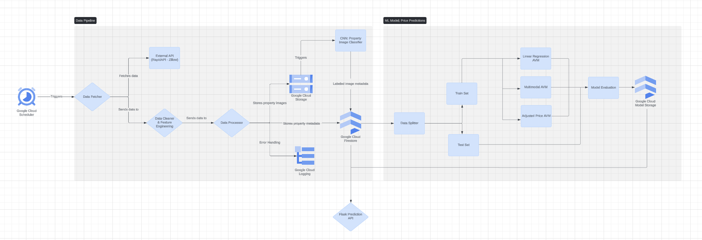

# System Architecture

## Overview

The system architecture for the Real Estate AVM is designed to ensure efficient data collection, processing, storage, and machine learning model training for predicting property prices.

## Components

1. **Data Fetcher**
   - Fetches real estate data from Zillow API using RapidAPI.
2. **Data Cleaner & Feature Engineering**
   - Cleans and preprocesses the fetched data.
3. **Data Processor**
   - Uploads property images to Google Cloud Storage and stores metadata in Firestore.
4. **ML Model for Image Labeling**
   - Processes property images and stores labeled metadata.
5. **ML Model for Price Predictions**
   - Includes Linear Regression, Multimodal with CNN, and Ensemble models with price adjustments.
6. **Prediction API**
   - Provides endpoints for fetching property data, making price predictions, and retrieving market analysis.
7. **React Frontend**
   - Interactive web interface for users to view reports and predictions.
8. **Google Cloud Services**
   - Google Cloud Storage, Firestore, AI Platform, Cloud Functions.
9. **Error Handling & Logging**
   - Handles and logs errors using Google Cloud Logging.

## Diagrams

Diagram created in Lucidchart.

